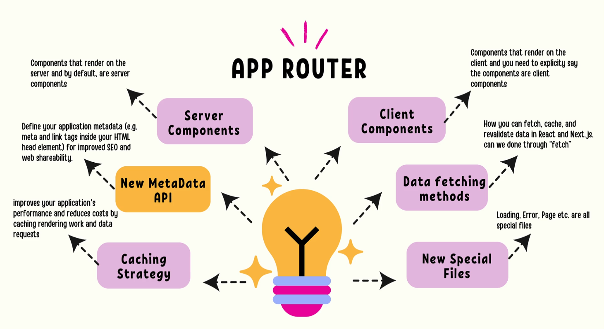

# NextJS Notes

- App Router is future of building apps in NextJs and currently some companies still use Pages Router.If you're new to NextJS go with App Router.
  
- Next.js course Handbook - contains resources and links as part of learning from [instructor](https://innate-noodle-e82.notion.site/Next-js-Course-Handbook-d1ed7f83a8044ada8c933a11f7b70dc3).

## Next.js Fundamentals (including React)

- we really need to understand why the technologies exist & what problems are they trying to solve.
- let's understand - why next.js exists if react is being used by some many devs out there?
  - what problems NextJs solves & how does it make frontend development so much easier.
- what is Next.js?
  - It is a framework built on `top of React` that gives you the `flexibility` of building scalable apps by `allowing you to render content on the server`.A Full Stack Framework.you can also build backend as NextJS provides node server out of the box.
  - In `React` you always render content on the client.With NextJS, you can choose to do on the client and on the server by default on pages you want.
- Benefits of Next.js?
  
  - Different Rendering Techniques:
    - With NextJS, you can choose how you want to render content on the page.
    - In React, you will always render content on the client side using client-side rendering & nothing happens on server.
    - Some of these techniques are: Static Side Generation (SSG), Server side rendering (SSR) & Incremental Site Regeneration (ISR).
    - If we have lot of blog posts, marketing content - then you want to use `Static Side Generation`. What happens in SSG is all your content gets pre-build on server & then the server will pass the content to the client & all this content is pre-built and cached. So your client is basically fetching cached content over and over. So you get a huge performance boost because of that reason. Ex: A list of products & list of blog posts and the application we will build (Static Coffee Stores) uses SSG.
    - `SSR` -> we can generate the site on the server, if you want to refresh data on page refresh that is SSR. you're rendering content on the Server, but each time as you refresh the page- you're rendering the content & refreshing the data again.Ex: use SSR for applications like Dynamic News feed, Netflix.
    - `ISR` -> incremental Site Regeneration -> best of both techniques -> You get SSG along with SSR -> able to generate page in advance part of build process and render content on server as well.
- Performance with NextJs?
  
  - It is incredibly difficult to build performant applications. NextJS takes care of lot of complexity for us, so we don't want to worry about performance too much.
  - You get performance for free with Next.js
  - Some features that help with performance comes out of the box, those features are -> Code Splitting, Minifying files, Image Optimization, Pre-fetching assets.
  - Code Splitting is essentially a technique, that will help you divide your web app in `small chunks` so you can only load the chunk that is used by the current page.
    - in order to do code splitting in react , you need to bring in more packages and also learn how to do code splitting. But NextJS it already takes care of it for you. So you can focus on building the application.It comes out of the box. Don't have to write any special code for it.
    - Next build provides the optimized build of your application. it creates chunks in a way when you visit a page the server only loads the chunks of that page we're trying to visit but not entire app.
  - Code minification - gets rid of special characters, white spaces and so on to make the file size really tiny. So the files that gets packaged to the browser are really small. Therefore you get a huge performance boost because of that as well. In react, we had to do code minification using webpack , we had to learn all of that.
  - Image Optimization : the next image component provided by NextJS - which optimizes the images automatically. NextJS instead of using image tag from the browser - it will use Image Component from next.js - serves the image based on browser size -> mobile - small , browser - large.
  - Pre-fetching assets - whenever you visit a page, NextJS will automatically pre-fetch the assets for the next page you're going to visit. So when you click on the link, it will load instantly.
- Image Component in Next.js:
  - Based on specific view port, it automatically going to render a different file size, which helps so much with performance.
  - pre-fetching feature of next.js : performant application because we're only downloading the specific image as the user is about to go to that area.
- File based Routing and SEO:
  
  - Next.js has intuitive file based routing system. The image above is example of Next.js project, which consists of pages directory, the minute you create a new file under pages directory, you automatically have a route as we see in above image. No need to install additional package like react-router in create-react-app. This specific pages has also support for dynamic page routes as well.
  - it also helps with performance. If you go to a specific route in next.js and next.js only loads that route & resources needed. if you share a bunch of code between routes , next.js also takes care of chunking that part of code.
  - next.js also has this specific api folder. Which holds all the backend logic, all the server side code of our project. any route you create inside api folder is essentially a server side route.
  - SEO is important for any application, next.js has built-in support for SEO. It automatically generates meta tags and other things that are required for SEO. In react, we had to use third party packages like react-helmet to do that.
    - SEO stands for Search Engine Optimization.A language for the Bots.if you configure your web app to have specific properties such as have proper titles, have metadata that becomes the language of your web app to communicate with bots, so that we're making the life of bots easier to discover our content.
      
    - we publish or deploy our app -> a bot will go and crawl your page as it discovers it -> tried to understand what the page is about -> then it ranks our page -> displays your page on Google.
    - Next.js has built-in support for SEO, it automatically generates meta tags and other things that are required for SEO.
- Serverless Functions with next.js:
  
  - In the above image the file - hello.js is actually a serverless function - what is the advantage here? -> why do we want to make sure our frontend talk to the backend.The minute we call /api/hello -> it will wake up the server & start a brand new node server & execute the code inside & shuts down the server.
