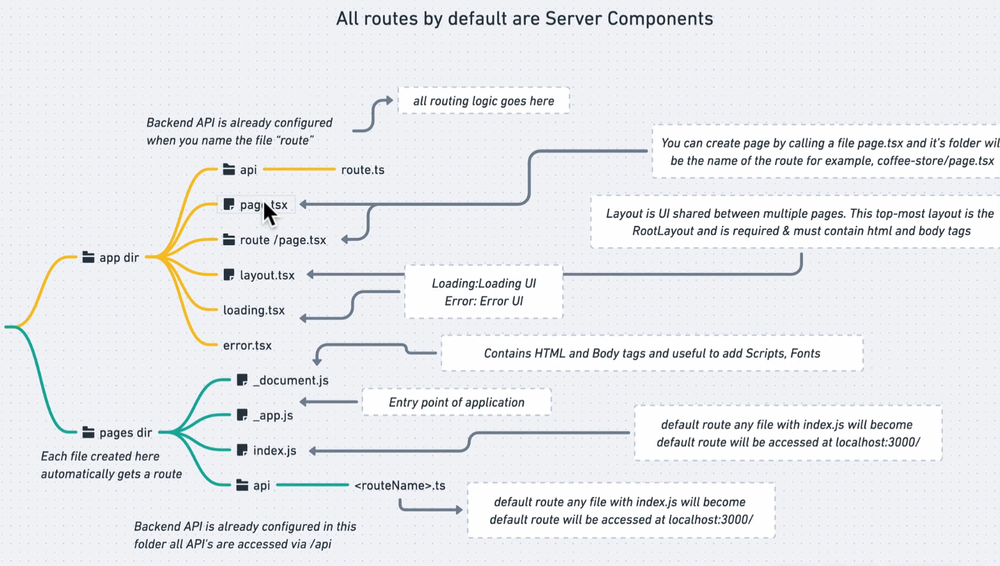

# Next.js Setup project Walkthrough:

This is a walkthrough for setting up a Next.js project with TypeScript, Tailwind CSS, and ESLint.

- let's take a look at all the files and folders - create next app setup for us -. so that we're more comfortable whenever we want to make any changes in the project.
- project-structure - official doc - [reference](https://nextjs.org/docs/app/getting-started/project-structure)

## My Notes

- Next.js Project Structure:

  - 📁 public - has few files next.svg, vercel.svg ..etc - You use this folder to store all public static assets like icons, fonts, svg files, images ..etc
  - app directory
    - global.css file -> contains Styles that will be applied throughout your application example : applying font family will happen here.
  - package.json -> we have scripts , dependencies , devDependencies sections which are used to execute commands, dependencies needed to run our application and dev ones are needed during development but not on production.
  - About remaining files watch the setup walkthrough videos.
  - NextJS came up with app router - so anytime you create a new route inside app router, it is by default a server component. You basically think of logic from server side first then client side later.
    
  - In app directory:
    - page.tsx is the default route. Any time you want to create new page then we need to call it let's say as create a coffee-store/page.tsx file. remember the name of the file should be page.tsx under the page_name: coffee-store as folder.
    - layout.tsx -> is the UI that is shared between multiple pages. This top-most layout is the RootLayout and is required & must contain html and body tags.
  - Another one is route.ts in api directory - where all the routing logic goes in here.

- What is Tailwind CSS?
  - We will be using it as design framework - official site to [refer](https://tailwindcss.com/).
  - Tailwind css is a utility first css framework where they gives us bunch of utilities so that we can write fast css code & able to design efficiently.
  - Next.js provides tailwind.css by default.
  - Ankita Kulkarni YT can be used as reference to learn in depth.
  - sm:items-start, flex, min-h-screen ..etc all these are tailwind css utilities that wraps css code.
  - Tailwind CSS is a utility-first CSS framework that provides low-level utility classes to build custom designs: `pnpm add -D tailwindcss @tailwindcss/postcss`
