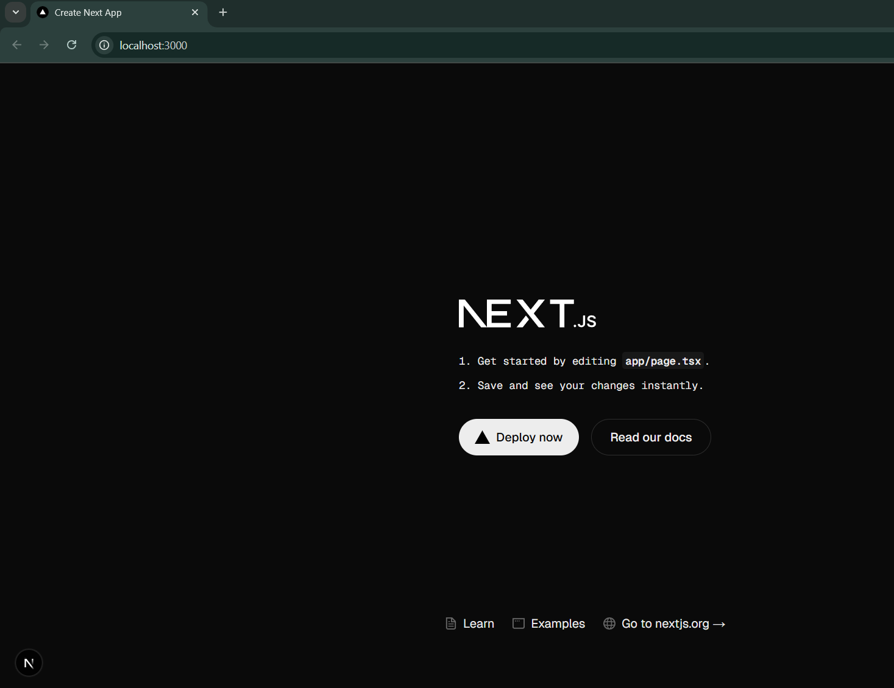

# Next.js 15 Crash Course

- Offline Notes
- Setup
- Explore the setup - the files created when setting up our app.

## Setup

- Getting started with default next.js app

```bash
abhis@Tinku MINGW64 ~/Desktop/NextJS/nextjs (main)
$ npx create-next-app@latest
Need to install the following packages:
create-next-app@15.5.3
Ok to proceed? (y) y

√ What is your project named? ... ./ #Installs the app in the `nextjs` root folder itself.
√ Would you like to use TypeScript? ... No / Yes #yes
√ Which linter would you like to use? » ESLint #Select this out of given options
√ Would you like to use Tailwind CSS? ... No / Yes #Yes
√ Would you like your code inside a `src/` directory? ... No / Yes #No
√ Would you like to use App Router? (recommended) ... No / Yes #Yes
√ Would you like to use Turbopack? (recommended) ... No / Yes #Yes
√ Would you like to customize the import alias (`@/*` by default)? ... No / Yes #No
Creating a new Next.js app in C:\Users\abhis\Desktop\NextJS\nextjs.

Using npm.

Initializing project with template: app-tw


Installing dependencies:
- react
- react-dom
- next

Installing devDependencies:
- typescript
- @types/node
- @types/react
- @types/react-dom
- @tailwindcss/postcss
- tailwindcss
- eslint
- eslint-config-next
- @eslint/eslintrc


added 400 packages, and audited 401 packages in 3m

166 packages are looking for funding
  run `npm fund` for details

found 0 vulnerabilities
Success! Created nextjs at C:\Users\abhis\Desktop\NextJS\nextjs
```

## Explore the setup

- Now that your project is setup and ready to go -> You'll notice many files and folder - let's go through them Bottom to TOP.
- `tsconfig.json` -> The configuration file for typescript. It defines what should be Type - checked? - Ignored? - Rules to follow.
- `tailwind.config.ts` - (Not here now) - This is where you add additional tailwind setup. Extend Tailwind by customizing colors, sizes, Shadows, Plugins or anything you might need.
- `postcss.config.mjs` - It's a configuration file for postcss - A tool used to process CSS with different plugins -> in this case it uses `tailwindcss` as a plugin -> which allows you to use utility first classes in your project.
- `package-lock.json` - A file that locks the version of dependencies & their sub-dependencies ensuring that everyone working on project uses the exact same versions.
- `package.json` - contains all the current dependencies and
  - **scripts**:
    - there is a `dev` script which starts nextjs in a development mode with HMR(hot module reloading) , error reporting and more.
    - `build` - creates an optimized production build of your app.
    - `start` - Simply starts nextjs in production mode.
    - `lint` - which runs eslint for all files in the app directory and more.
  - **dependencies**: react, react-dom and current version of next
- `next-env.d.ts`: which is a typescript declaration file for nextjs & which should not be edited.
- `next.config.ts` - Allows you to configure nextjs features - such as -> experimental options, image settings & build settings & more.
- `.gitignore` - it's very important not to miss adding something there. (nextjs adds the `.env` for us already).
- `eslint.config.mjs`/`.eslintrc.json` - allowing you to configure your linting options.
  = Folders: - **public**: Which contains static assets -> always put your images and other static data here.

  - **node_modules**: The heaviest object in the universe. It is a folder containing all the dependencies or packages needed to run your application.
  - **app**: The most important folder in nextjs application, In here:
    - `page.tsx` - we have our primary homepage.

- Before running our application - i want to get rid of npm and make use of pnpm here onwards to install dependencies & all and Now i remove npm's package-lock.json & node_modules - using this command in terminal - `$ rm -rf node_modules/ package-lock.json` and do `pnpm install` & we get back `node_modules` and `pnpm-lock.yaml` & `pnpm-workspace.yaml`.

```bash
abhis@Tinku MINGW64 ~/Desktop/NextJS/nextjs (main)
$ rm -rf node_modules/ package-lock.json

abhis@Tinku MINGW64 ~/Desktop/NextJS/nextjs (main)
$ pnpm install

   ╭──────────────────────────────────────────╮
   │                                          │
   │   Update available! 10.10.0 → 10.16.1.   │
   │   Changelog: https://pnpm.io/v/10.16.1   │
   │     To update, run: pnpm self-update     │
   │                                          │
   ╰──────────────────────────────────────────╯

Downloading next@15.5.3: 30.29 MB/30.29 MB, done
Downloading @next/swc-win32-x64-msvc@15.5.3: 46.48 MB/46.48 MB, done
Packages: +325
+++++++++++++++++++++++++++++++++++++++++++++++++++++++++++++++++++++++++++++++++++++++++++++++++++++++++++++++++++++++++++++++++++++++++++++++++++++++++++++++++++++++++++++++++++
Progress: resolved 396, reused 317, downloaded 13, added 325, done

dependencies:
+ next 15.5.3
+ react 19.1.0 (19.1.1 is available)
+ react-dom 19.1.0 (19.1.1 is available)

devDependencies:
+ @eslint/eslintrc 3.3.1
+ @tailwindcss/postcss 4.1.13
+ @types/node 20.19.14 (24.4.0 is available)
+ @types/react 19.1.13
+ @types/react-dom 19.1.9
+ eslint 9.35.0
+ eslint-config-next 15.5.3
+ tailwindcss 4.1.13
+ typescript 5.9.2

╭ Warning ───────────────────────────────────────────────────────────────────────────────────╮
│                                                                                            │
│   Ignored build scripts: @tailwindcss/oxide, sharp, unrs-resolver.                         │
│   Run "pnpm approve-builds" to pick which dependencies should be allowed to run scripts.   │
│                                                                                            │
╰────────────────────────────────────────────────────────────────────────────────────────────╯

Done in 28.7s using pnpm v10.10.0

abhis@Tinku MINGW64 ~/Desktop/NextJS/nextjs (main)
$ pnpm approve-builds
√ Choose which packages to build (Press <space> to select, <a> to toggle all, <i> to invert selection) · @tailwindcss/oxide, sharp, unrs-resolver
√ The next packages will now be built: @tailwindcss/oxide, sharp, unrs-resolver.
Do you approve? (y/N) · true
node_modules/.pnpm/@tailwindcss+oxide@4.1.13/node_modules/@tailwindcss/oxide: Running postinstall script, done in 685ms
node_modules/.pnpm/unrs-resolver@1.11.1/node_modules/unrs-resolver: Running postinstall script, done in 433ms
node_modules/.pnpm/sharp@0.34.3/node_modules/sharp: Running install script, done in 482ms
```

- Then To run our application and see it on the browser: `pnpm run dev or pnpm dev (both of them works)` -> runs on `localhost:3000` - the page we see is from the `page.tsx` in app directory - which represents the home page.
  

```bash
abhis@Tinku MINGW64 ~/Desktop/NextJS/nextjs (main)
$ pnpm run dev

> nextjs@0.1.0 dev C:\Users\abhis\Desktop\NextJS\nextjs
> next dev --turbopack

   ▲ Next.js 15.5.3 (Turbopack)
   - Local:        http://localhost:3000
   - Network:      http://192.168.29.185:3000

 ✓ Starting...
 ✓ Ready in 8.1s
 ○ Compiling / ...
 ✓ Compiled / in 8.5s
 GET / 200 in 9941ms
```

- Now let's get rid of `boilerplate` code and add this in return statement of Home component - `<h1 className="text-4xl">Welcome to Next.js</h1>` -> we can instantly see the text on browser - Which is because of `HMR (Hot Module Replacement)`.

- In `app`:
  - we have `fonts` folder -> where you can store font files - it's actually preferable to use Google fonts.
  - `favicon.ico` - it's file that appears on your browsers tab.
  - `globals.css` - Where we can write all of our custom css or simply import tailwindcss.
  - `layout.tsx` - This is the main entry point to your application -> Anything we do here will be applied across all pages and routes. That's why in there we are importing `fonts`, `styles` & the `metadata`. change the app title with `metadata` & see the change on browser(without reloading)
  - **All the changes that you make to your app goes inside this folder/directory**.
